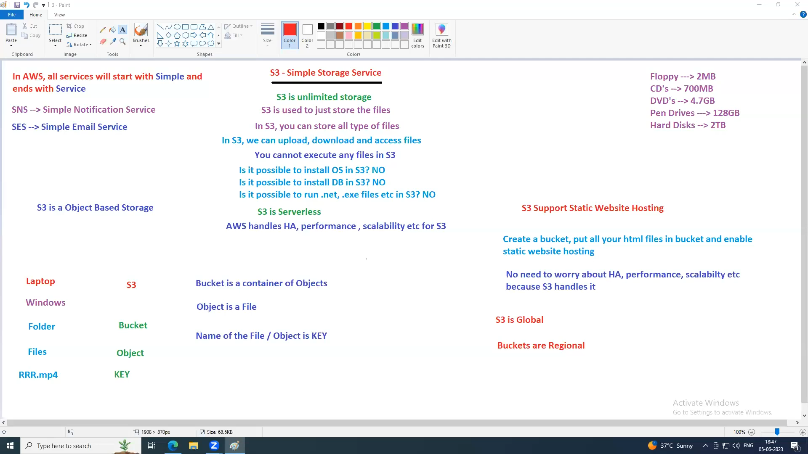

### S3
---
Stands for Simple Storage Service
In AWS, all services start with Simple and end with Service e.g (SNS - simple notification services)
S3 is unlimited storage.
In S3 we can upload, download and access files.
You can not execute any files on S3.
S3 is serverless
AWS handles HA, perfomance, scalability etc for S3
Folders in S3 are known as Buckets.
Files inside the buckets are known as objects.
Name of the object is known as Key.
S3 is object based storage.
You can host static websites on S3.
S3 is global
Buckets are regional.

##### How to host  static website
- Create a bucket, put all your html files in bucket and enable static website hosting.
- No need to worry about HA, perfomance, scalability etc because S3 handles.

### EBS (Elastic Block Storage)
---

Hard disk will be called volumes and in this case EBS Volume
The default volume for ec2 instance is 30GB for windows OS and 10GB for linux.
EBS is a centralized volume.
Create volume and attach it to the EC2 instance.
Volumes can be attached and detached.
EBS is block based storage.
The default volume is known as Root volume e.g c-drive is root volume for windows.
You can attach multiple volumes to the EC2 instance.
Root volume always contains OS (linux, windows)
There are two types of OS
- Client OS - Win 10,11
- Server OS - Win server 2021, RedHat, CentOS, Ubuntu, SUSE, amazon linux

EC2 supports only Server OS not Client OS
If you have OS on the volume, that volume is called ROOT volume.
EC2 instance has only 1 ROOT volume.
EC2 can have multiple additional volumes.
Maximum size of the EBS Volume is 16TB.
Volumes can be pre-provisioned like 50GB, 100GB,
1 Volumes can not be attached to multiple EC2 instances at the same time by default.**
Volume size can be increased on fly without stopping EC2 instance
Volume size can not be decreased.(delete the volume and re-create it based on your requirement)

#### Device Names
A device name is the identifier used by the operating system on your EC2 instance to recognize and attach the EBS volume.

When you attach an EBS volume to an EC2 instance, AWS assigns it a device name like
- On Linux: /dev/sda1, /dev/sdf, /dev/xvdf
- on Windows: it appears as a new disk (e.g xvdf) in Disk Management
The root volume where the OS is installed shows up as /dev/sda1
Additional volumes you attach get names like /dev/sdf, /dev/sdg, etc
Root volume is always mounted as /dev/sda1
It is not possible to detach Root volume while EC2 is running
First stop the EC2 instance first and then detach the Root Volume
It's possible to detach the ADDITIONAL volulme while EC2 is running. Though it is not recommended to detach while running, stop first.
We cannot attach 1a volume to 1b EC2 instance 

