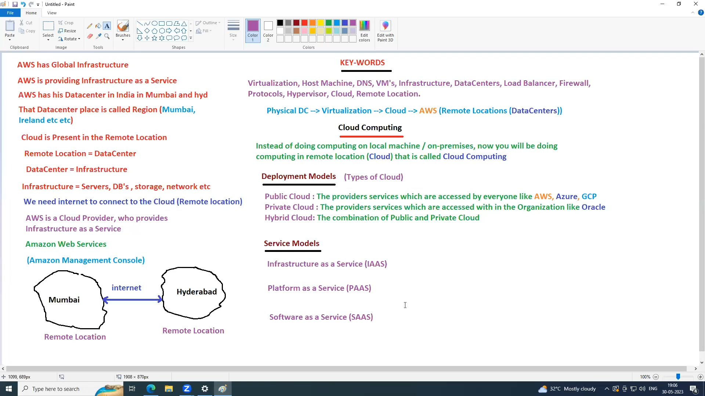

AWS has Global infrastructure.
AWS is providing infrastructure as a service.
AWS has Datacenter globally and is called Region.
Cloud is present in the Remote Location
Remote Location is a Datacenter
DataCenter contains infrastructure.
Infrastructure contains Servers, DBs, storage, network etc
Internet is needed to connect to the Cloud(Remote location)
AWS is cloud provider who provides infrastructure as a Service.
Amazon Web Services.
We connect to AWS using Amazon Management Console
When we compute in a remote location it's known as cloud computing.

## Deployment Models
---
- Public cloud: Services accessed by everyone like AWS, Azure, GCP
- Private Cloud: Services which are accessed within the organization e.g Oracle
- Hybrid Cloud: Combination of public and private.

## Service Models
---
- Infrastructure as a Service(IaaS). 
- Platform as a Service (PaaS)
- Software as a Service (SaaS)

