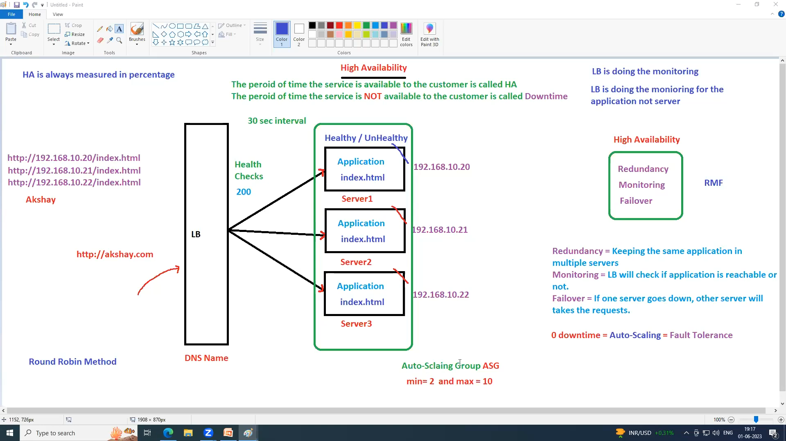
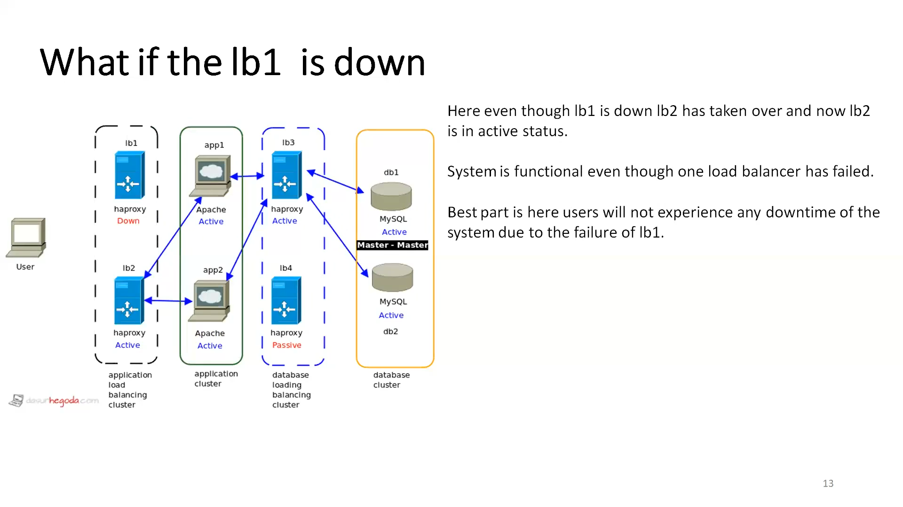

  An availability zone (AZ) is a physical separate data center within an AWS Region, designed to provide isolation from failures while still being connected with low-latency networking.

Region - a geographical area (e.g US-East, eu-west)
Availability Zone - one or more data centers within that region
Each Region has at least 2 AZs, usually 3 or more.

Instances are placed in AZs
AZs can communicate with each other by default.
Best practice is to distribute the EC2 instances across AZs

There is slim chance that 1 AZ goes down because it is  a group of Datacenters.

By default two regions don't communicate with each other. if required Yes.

### Virtual Private Cloud
---
Is a logically isolated network you create within the AWS cloud.
Think of it as your own private data center inside AWS, where you can launch and manage resources (like ec2 instances, databases, load balancers etc) in a secure and controlled environment.

##### Key Points about VPC
- Isolation. Each VPC is isolated from other VPCs by default.
- IP Addressing. You define CIDR block(eg 10.0.0.0/16) that determines the privae IP range for your VPC.
- Subnets. You devide the VPC into subnets. which can be
      - Public subnet -> Accessible from the internet (via an internet Gateway)
      - Private subnet -> internal only (no direct internet access)
- Routing: You control traffic flow using route tables.
- Connectivity. You connect your VPC to:
     - The internet 
     - Your corporate network (VPN or Direct Connect)
     - Other VPCs (VPC peering or Transit Gateway)
- Security: Your protect your resources with: 
     - Security Groups (instance-level firewalls)
     - Network ACLs (subnet level firewalls)

Load balancer is regional and has capacity to distribute traffic to different AZ