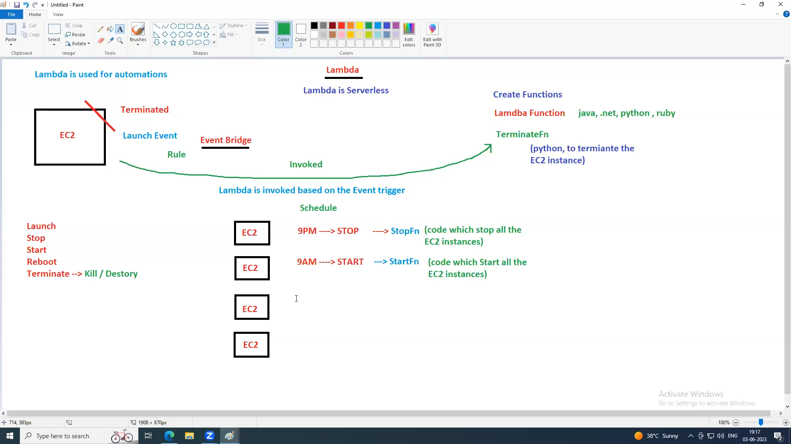

### EC2
---
Means Elastic Compute Cloud
It's a virtual server in the cloud that you can use to run apps, webs or workloads just like you would on a physical computer, but hosted in AWS's data centers.
AWS services can be  either regional or global.
EC2 is regional. 

### ELB
---
Means elastic load balancer
Load balancer distributes traffic to servers.
ELB distribute the traffic to the multiple EC2 instances across AZs
ELB is completely managed by AWS.
ELB is not a server, it is a service
You can not login to the ELB,  you can access the ELB using DNS (URL)
ELB doesn't have an AZs, it's is created at Regional Level.

### EBS
---
Means Elastic BeanStalk.
Used for easy and quick deployment of applications in AWS.
In general, PAAS -> you don't have any control on the servers.
But in EBS you have full control on EC2 instance launched by BeanStalk
BeanStalk handles EC2 instances (OS) on behalf of us.

### LightSail
---
If you want to setup and create a virtual private server which already has everything installed e.g wordpress, joomla, drupal, cpanel, gitlab, redmine etc.
Light sail does not support auto-scaling.

Light sail is a simplified version of EC2 - a beginner friendly service that lets you quickly launch virtual servers (with preconfigured OS, apps, and networking) at a fixed monthly price

Think of it as easy, low-cost VPS hosting on AWS for websites, apps or Small projects.

### Lambda
---
Lambda is a serverless compute service
It lets you run code without managing servers. You just write your fn (in py, java, Nodejs etc), upload it , and lambda runs it when triggered - scaling.
##### Key Points
- No servers to manage. AWS handles provisioning, scaling, and availability.
- Event- driven. Runs in response to events (eg API call, file upload to S3, DynamoDB update, CloudWatch event)
- Pay per use - You only pay for the execution time (in ms) and resources used.
- Scales automatically - from a single request to thousands per second.

##### Event Bridge
Is a serverless event bus service in AWS.
It helps you connect apps using events - so when something happens in one service, it can automatically trigger actions in another.

###### Key Points
- Event Bus - acts like a central hub for events.
- Sources - events can move from AWS services (e.g. S3, EC2, Lambda), your own apps, or SaaS apps.
- Targets - Events can trigger AWS services like Lambda, Step Functions, SNS, SQS, or even other event buses.
- Filtering & Routing - You can set rules to decide which events go where.
- Serverless - Fully managed, Scales automatically, and you only pay for events processed.